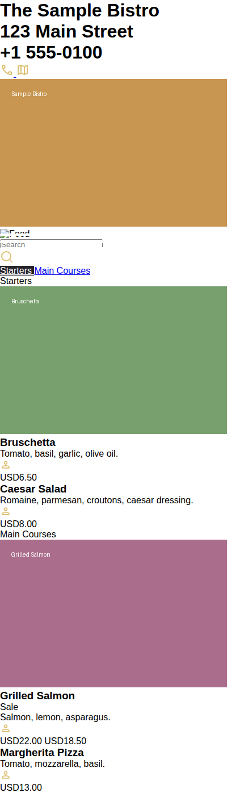

# Menu Maker

A Django app for building and hosting digital restaurant menus. Create a
menu with categories and items, choose a display template, and share a
link (or QR code) that customers can open on their phone. Menus support
multiple languages, item images, pricing (with optional "sale" pricing),
ingredients, and labels for combos, group-size, and vegan items.

## Screenshots

| Language selector | Menu page |
| --- | --- |
|  |  |

## Features

- Manage menus, categories, and items through the Django admin
  (with import/export support via `django-import-export`).
- Multi-language menus and admin content, powered by `django-modeltranslation`.
- Pluggable menu templates (`templates/<name>/menu.html`).
- Optional sale pricing (`compare_at_price`), ingredients, and images per item.
- Item labels for combo, group-size, and vegan items.

## Getting started

1. Install dependencies:

   ```bash
   pip install -r requirements.txt
   ```

2. Create a `.env` file in the project root with at least:

   ```
   SECRET_KEY=your-secret-key
   ```

3. Apply migrations and load the language fixtures:

   ```bash
   python manage.py migrate
   python manage.py loaddata languages.json
   ```

4. Create a superuser to access the admin panel:

   ```bash
   python manage.py createsuperuser
   ```

5. Run the development server:

   ```bash
   python manage.py runserver
   ```

6. Open `http://127.0.0.1:8000/admin/` to create a menu, its categories,
   and items, then visit `http://127.0.0.1:8000/en/menu/<menu_id>/` to
   view it.
